# ResolveIQ

### AI-Powered Customer Support Investigation and Resolution Agent

ResolveIQ is an agentic customer-support system that investigates customer issues using customer, order, payment, support-ticket, and policy information before deciding whether to resolve the request, perform an allowed action, or escalate it to a human support agent.

The system is designed around an investigation-first approach rather than a simple question-and-answer chatbot.

---

## 1. Overview

Traditional customer-support chatbots primarily generate responses from the conversation itself.

ResolveIQ follows a structured investigation workflow.

When a customer submits a request, the system:

1. Identifies the customer's intent.
2. Determines which information is required.
3. Retrieves customer, order, payment, and ticket information through backend tools.
4. Retrieves relevant company policy using Retrieval-Augmented Generation (RAG).
5. Builds an evidence context.
6. Uses the decision layer to determine whether the issue can be safely resolved.
7. Executes an approved action when applicable.
8. Escalates the case when automated resolution is unsafe or insufficient.
9. Returns a customer-facing response.
10. Surfaces escalated cases through the human-agent dashboard.

### Investigation-First Approach

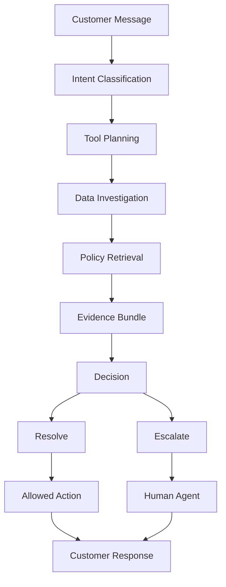

The key distinction is:

```text
Traditional approach:

Customer -> LLM -> Answer


ResolveIQ:

Customer
   |
   v
Intent
   |
   v
Investigation
   |
   v
Tools + Data
   |
   v
Policy Retrieval
   |
   v
Evidence
   |
   v
Decision
   |
   +------------+
   |            |
   v            v
Resolve      Escalate
   |            |
   v            v
Action       Human Agent
   |
   v
Customer Response
```

---

# 2. Problem

Customer-support requests often require information from multiple sources before a reliable resolution can be provided.

A single customer request may require:

- Customer profile
- Order status
- Payment status
- Previous support tickets
- Company policies
- Previous resolution history

For example:

> "My order was cancelled but I was already charged. Can I get a refund?"

The message alone is not sufficient to determine the correct action.

The system needs to verify:

```text
Customer
   +
Order
   +
Payment
   +
Previous Tickets
   +
Refund Policy
   |
   v
Investigation
   |
   v
Decision
```

ResolveIQ automates this investigation process and provides a controlled path toward resolution or escalation.

---

# 3. Core Concept

ResolveIQ separates three major responsibilities:

```text
Investigation
      |
      v
Decision Making
      |
      v
Execution
```

The LLM does not directly control arbitrary database operations.

Instead, the backend controls the workflow:

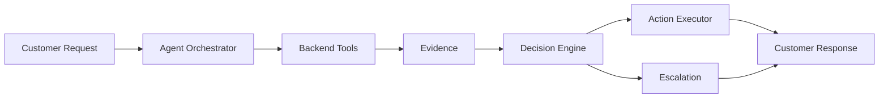

This makes the agent workflow explicit, inspectable, and controlled.

---

# 4. System Architecture

## 4.1 Current Prototype Architecture

The current ResolveIQ prototype consists of:

- React and Vite customer interface
- React and Vite human-agent dashboard
- Node.js and Express backend
- Custom agent orchestration layer
- MongoDB Atlas database
- Controlled backend tools
- Python-based RAG service
- Sentence Transformers embeddings
- FAISS vector search
- Ollama with Gemma 3 4B
- Deterministic decision and escalation logic

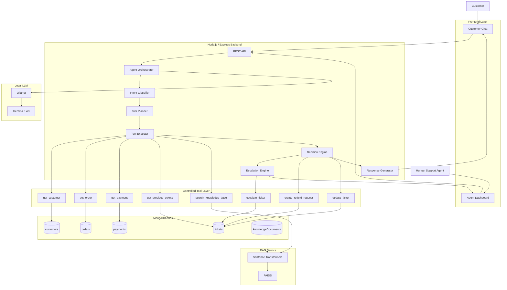

---

## 4.2 Prototype Architecture Summary

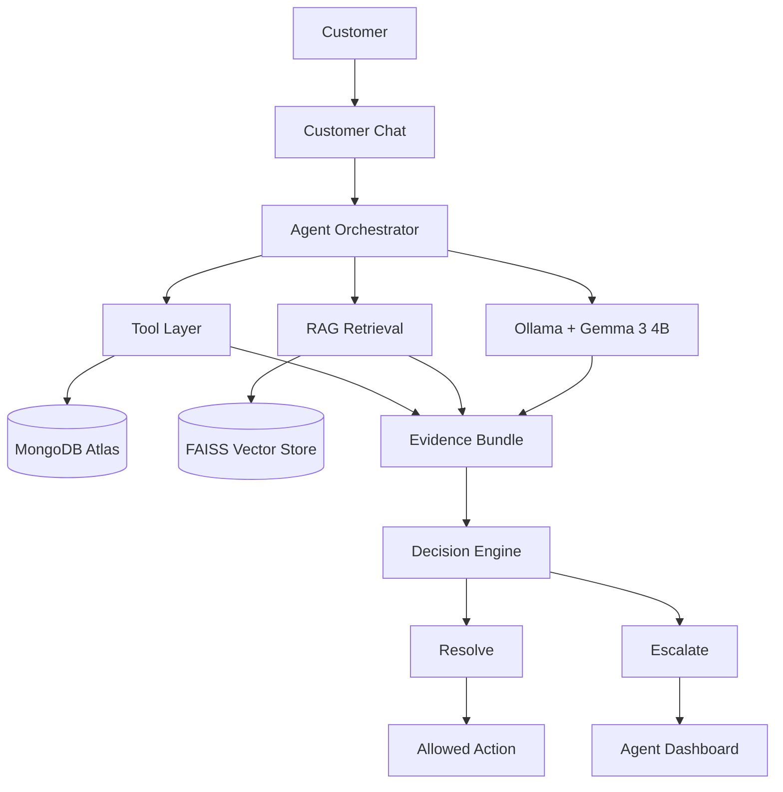

The prototype therefore implements an end-to-end investigation workflow rather than only a frontend demonstration.

---

# 5. Agent Investigation Flow

Every support request passes through a controlled sequence.

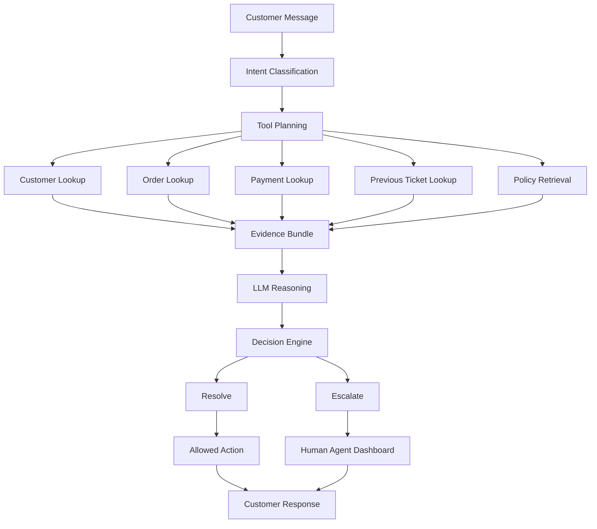

---

# 6. Intent Classification

ResolveIQ supports the following intent categories:

```text
order_status
refund_request
payment_issue
cancellation_issue
general_policy_question
complaint_unresolved
unknown
```

The detected intent determines which investigation tools are required.

### Example

For a refund request:

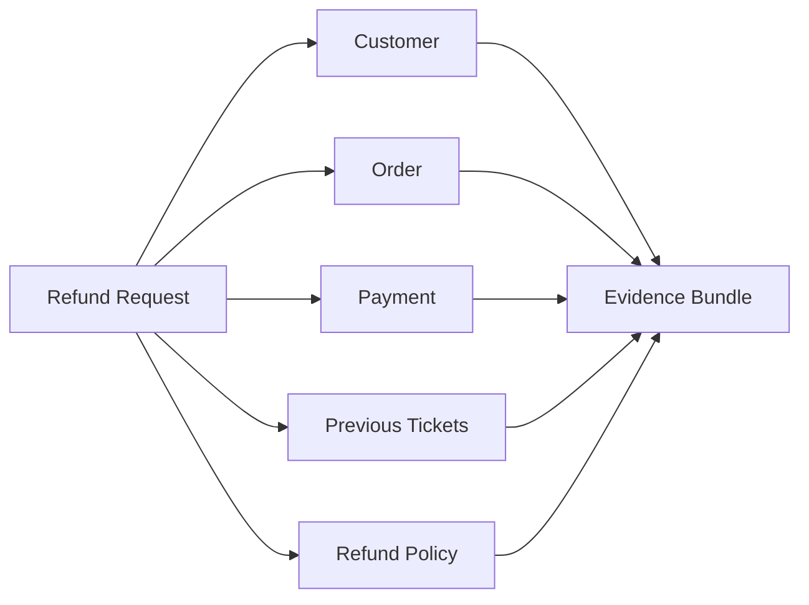

---

# 7. Tool Layer

ResolveIQ uses a controlled backend tool registry.

| Tool | Purpose |
|---|---|
| `get_customer` | Retrieve customer information |
| `get_order` | Retrieve order information |
| `get_payment` | Retrieve payment information |
| `get_previous_tickets` | Retrieve and analyze support history |
| `search_knowledge_base` | Retrieve relevant policy information |
| `create_refund_request` | Execute the refund workflow |
| `update_ticket` | Update support ticket information |
| `escalate_ticket` | Escalate an unresolved case |

The tool layer separates data access and system actions from the language model.

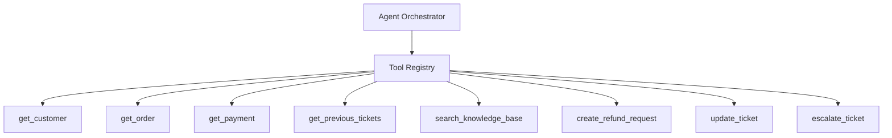

---

# 8. RAG Knowledge Retrieval

ResolveIQ uses Retrieval-Augmented Generation for policy-related investigation and responses.

The current RAG service uses:

- Sentence Transformers
- `all-MiniLM-L6-v2`
- FAISS
- `IndexFlatIP`
- Python retrieval service
- FastAPI endpoint

## 8.1 RAG Pipeline

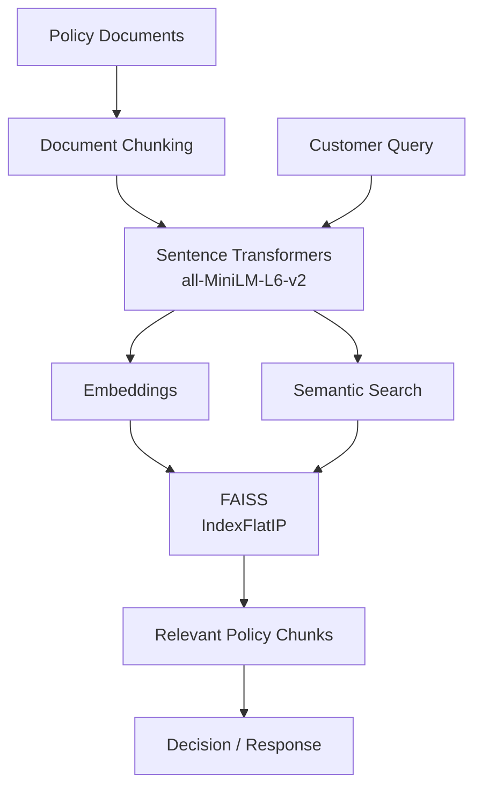

## 8.2 Retrieval Flow

```text
Policy Documents
       |
       v
Chunking
       |
       v
Embeddings
       |
       v
FAISS Vector Index
       |
       v
Semantic Search
       |
       v
Relevant Policy
       |
       v
Evidence
       |
       v
Decision / Response
```

The Python retrieval service is separated from the Node.js orchestration layer and is accessed through the knowledge-base tool.

---

# 9. LLM Layer

The current prototype uses a local LLM through Ollama.

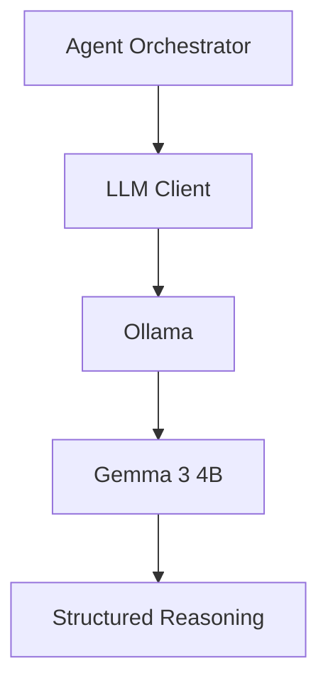

### Current LLM

```text
Runtime: Ollama
Model: Gemma 3 4B
```

The LLM is used as part of the controlled agent workflow. It does not receive unrestricted access to the database or arbitrary system operations.

---

# 10. Decision Engine

After the required investigation is completed, ResolveIQ evaluates the collected evidence.

For example, the refund workflow verifies:

```text
Order exists
      +
Payment exists
      +
Payment successful
      +
Order is eligible
      +
Refund policy supports the request
      |
      v
Refund Decision
```

The decision engine determines whether the request can proceed safely.

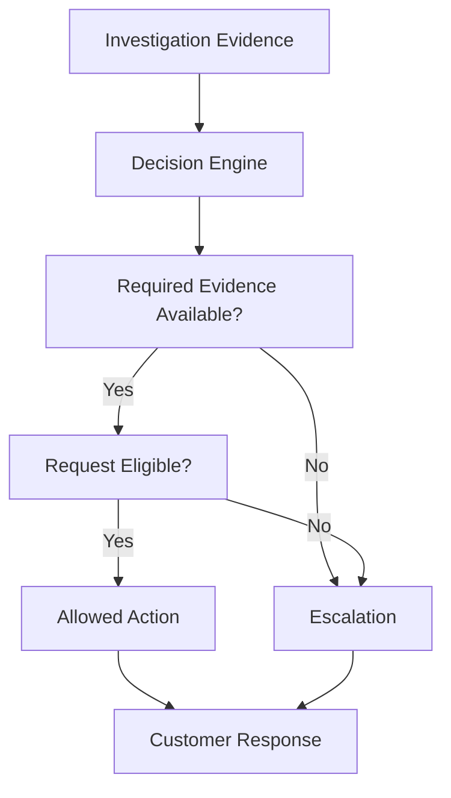

---

# 11. Deterministic Escalation

ResolveIQ does not rely only on the LLM to determine whether human intervention is required.

The escalation layer evaluates explicit conditions.

Current escalation conditions include:

- Low confidence
- Required tool failure
- Missing required knowledge evidence
- Three or more unresolved related tickets
- Unsafe action
- High urgency with strong negative sentiment, except simple order-status requests

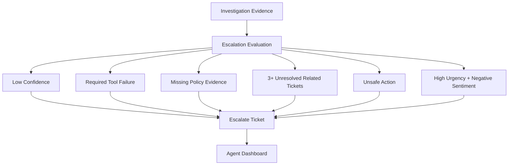

This creates a controlled fallback when automated resolution is insufficient.

---

# 12. Human Agent Workflow

When a request is escalated, the case is surfaced through the agent dashboard.

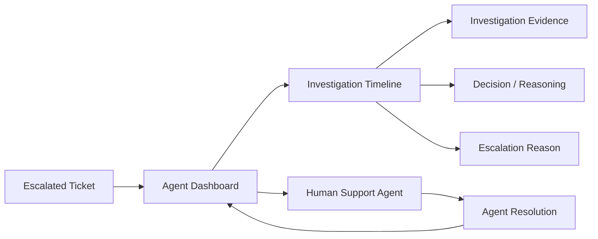

The dashboard provides information such as:

```text
Customer
Issue
Priority
Intent
Investigation Evidence
Tools Used
Policy Information
Decision
Escalation Reason
Ticket Status
```

The objective is to give the human agent the investigation context instead of requiring the investigation to be repeated manually.

---

# 13. Data Architecture

MongoDB Atlas stores the primary application data.

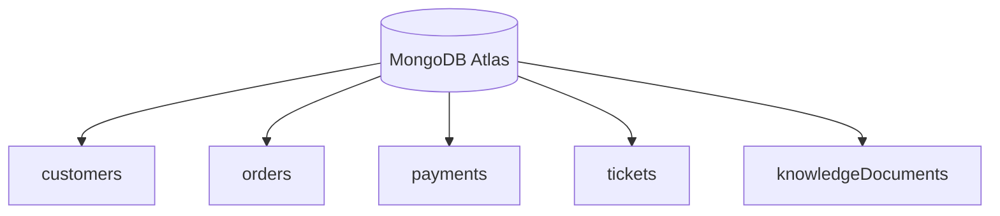

### Main Collections

```text
MongoDB Atlas
|
+-- customers
|
+-- orders
|
+-- payments
|
+-- tickets
|
+-- knowledgeDocuments
```

The prototype uses seeded data to provide realistic customer-support scenarios.

---

# 14. Action and Safety Architecture

The LLM does not directly modify arbitrary database records.

Actions pass through the backend-controlled action layer.

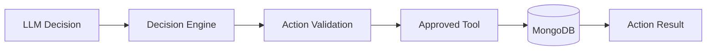

For example:

```text
LLM Decision
     |
     v
Decision Engine
     |
     v
Action Validation
     |
     v
create_refund_request
     |
     v
MongoDB
```

This prevents the language model from directly performing arbitrary database mutations.

---

# 15. Demo Scenarios

The prototype is designed around four core scenarios.

## 15.1 Scenario 1: Order Status

Customer request:

```text
Where is my order?
```

Flow:

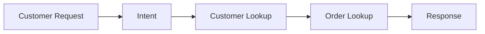

The agent identifies the order-status intent, retrieves the customer and order information, and generates a response based on the retrieved data.

---

## 15.2 Scenario 2: Refund Investigation

Customer request:

```text
My order was cancelled but I was already charged.
Can I get a refund?
```

Flow:

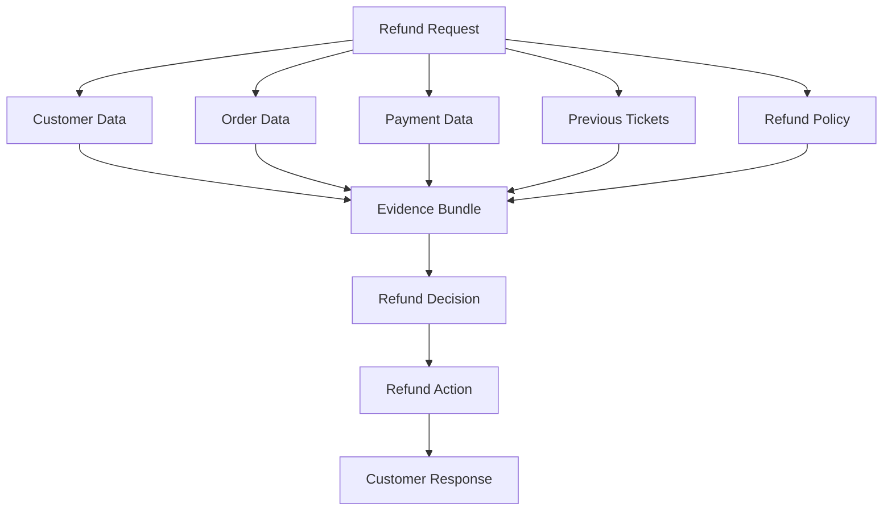

The system verifies the relevant customer, order, payment, ticket history, and refund-policy information before executing the refund workflow.

---

## 15.3 Scenario 3: Policy Question

Customer request:

```text
What is your refund policy?
```

Flow:

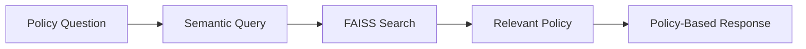

The system retrieves the relevant policy information using semantic search rather than relying only on the language model's internal knowledge.

---

## 15.4 Scenario 4: Repeated Unresolved Complaint

Customer request:

```text
I have contacted support multiple times
and this still isn't resolved.
```

Flow:

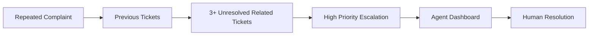

This demonstrates the human-in-the-loop escalation path.

---

# 16. End-to-End Request Flow

The complete ResolveIQ workflow can be summarized as:

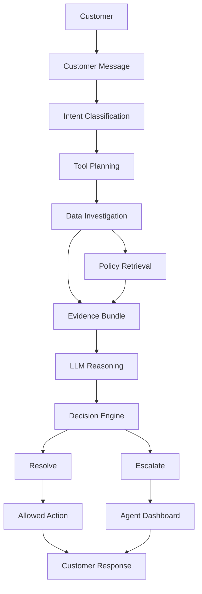

---

# 17. Current Prototype vs Future Production Architecture

## 17.1 Current Prototype

The current prototype implements:

```text
React / Vite
       |
       v
Express API
       |
       v
Agent Orchestrator
       |
       +---- Tool Layer ---- MongoDB
       |
       +---- RAG ---------- FAISS
       |
       +---- LLM ---------- Ollama / Gemma
       |
       v
Decision Engine
       |
       +----------------+
       |                |
       v                v
   Resolution       Escalation
                        |
                        v
                 Agent Dashboard
```

## 17.2 Future Production Architecture

The following represents a future production direction rather than the current implementation.

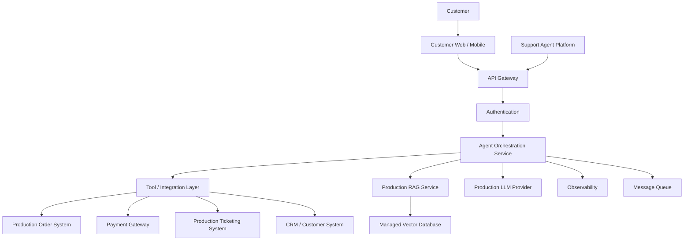

The production architecture would require additional infrastructure such as authentication, production integrations, scaling, observability, and external service integrations.

These components are intentionally outside the current MVP.

---

# 18. Tech Stack

| Layer | Technology |
|---|---|
| Frontend | React, Vite, Tailwind CSS |
| Backend | Node.js, Express |
| Database | MongoDB Atlas, Mongoose |
| Agent Orchestration | Custom Node.js orchestrator |
| LLM Runtime | Ollama |
| LLM Model | Gemma 3 4B |
| Embeddings | Sentence Transformers |
| Embedding Model | all-MiniLM-L6-v2 |
| Vector Search | FAISS |
| RAG Service | Python, FastAPI |
| API Communication | REST / JSON |
| Version Control | Git, GitHub |

---

# 19. Project Structure

```text
ResolveIQ/
|
+-- client/
|   +-- src/
|   |   +-- App.jsx
|   |   +-- App.css
|   |   +-- index.css
|   |
|   +-- package.json
|
+-- server/
|   +-- src/
|   |   +-- agent/
|   |   |   +-- agent.js
|   |   |   +-- agentTypes.js
|   |   |   +-- actionExecutor.js
|   |   |   +-- decisionEngine.js
|   |   |   +-- escalationEngine.js
|   |   |   +-- intentClassifier.js
|   |   |   +-- llmClient.js
|   |   |   +-- responseGenerator.js
|   |   |   +-- toolExecutor.js
|   |   |   +-- toolPlanner.js
|   |   |
|   |   +-- models/
|   |   |
|   |   +-- tools/
|   |       +-- getCustomer.js
|   |       +-- getOrder.js
|   |       +-- getPayment.js
|   |       +-- getPreviousTickets.js
|   |       +-- searchKnowledgeBase.js
|   |       +-- createRefundRequest.js
|   |       +-- updateTicket.js
|   |       +-- escalateTicket.js
|   |       +-- toolRegistry.js
|   |
|   +-- scripts/
|   |
|   +-- package.json
|
+-- rag-service/
|   +-- main.py
|   +-- requirements.txt
|   +-- ...
|
+-- knowledge/
|
+-- docs/
|   +-- Architecture.md
|   +-- FAD.md
|   +-- FTL.md
|   +-- PRD.md
|   +-- SAD.md
|   +-- TAD.md
|
+-- .env.example
+-- .gitignore
+-- README.md
```

---

# 20. API Overview

## Health Check

```http
GET /health
```

Checks whether the backend service is running.

## Customer Chat

```http
POST /api/chat
```

Processes a customer request through the ResolveIQ agent.

## Get Tickets

```http
GET /api/tickets
```

Retrieves support tickets for the agent dashboard.

## Update Ticket

```http
PUT /api/tickets/:ticketId
```

Updates the status or note of a support ticket.

---

# 21. Running Locally

## Prerequisites

Make sure the following are installed:

```text
Node.js
npm
Python
uv
MongoDB Atlas account
Ollama
```

The current prototype uses Ollama locally for the LLM.

---

## Step 1: Clone the Repository

```bash
git clone https://github.com/SrashtiChauhan/ResolveIQ.git
cd ResolveIQ
```

---

## Step 2: Configure Environment Variables

Create the required environment files using the provided examples.

Do not commit real credentials, database connection strings, or secrets.

Example:

```bash
cp .env.example .env
```

Configure the MongoDB connection and other required environment variables according to the project setup.

---

## Step 3: Install Backend Dependencies

```bash
cd server
npm install
```

Start the backend:

```bash
npm run dev
```

The Express server should start on the configured local port.

---

## Step 4: Install Frontend Dependencies

Open another terminal:

```bash
cd client
npm install
```

Start the frontend:

```bash
npm run dev
```

Open the Vite development URL shown in the terminal.

---

## Step 5: Start the RAG Service

Open another terminal:

```bash
cd rag-service
uv sync
```

Then start the service:

```bash
uv run python main.py
```

The retrieval service runs locally and provides the knowledge-retrieval endpoint used by the backend.

---

## Step 6: Start Ollama

Make sure Ollama is running and the required model is available.

```bash
ollama run gemma3:4b
```

The backend communicates with the local Ollama runtime.

---

# 22. Demo Dataset

The prototype uses seeded MongoDB data for repeatable demonstration scenarios.

The main collections are:

```text
customers
orders
payments
tickets
knowledgeDocuments
```

The seeded dataset includes customer records, orders, successful and relevant payment states, support-ticket histories, and policy documents for the demo workflows.

The dataset is intended for prototype demonstration rather than production use.

---

# 23. Current MVP Scope

## Implemented

- Customer support chat
- Human-agent dashboard
- MongoDB-backed customer data
- MongoDB-backed order data
- MongoDB-backed payment data
- MongoDB-backed ticket data
- Intent classification
- Deterministic tool planning
- Controlled tool execution
- Policy retrieval using RAG
- Sentence Transformer embeddings
- FAISS semantic search
- Local Ollama LLM
- Gemma 3 4B integration
- Evidence-based decision workflow
- Refund action workflow
- Ticket updates
- Deterministic escalation
- Human-agent handoff
- Seeded demonstration scenarios

---

# 24. Future Scope

The following capabilities are outside the current MVP and can be added for a production deployment:

- Multi-tenant authentication
- Role-based access control
- Real payment gateway integration
- Production order-system integration
- Production ticketing-system integration
- External CRM integration
- Managed vector database
- Horizontal scaling
- Background job processing
- Production observability
- Centralized logging
- Monitoring and alerting
- Advanced evaluation and tracing
- Production-grade security
- Deployment automation

These are future production capabilities and are not represented as currently implemented features.

---

# 25. Documentation

The repository also contains detailed engineering documentation covering the system design and implementation planning.

```text
docs/
|
+-- Architecture.md
+-- PRD.md
+-- FAD.md
+-- FTL.md
+-- SAD.md
+-- TAD.md
```

### Documentation Roles

| Document | Purpose |
|---|---|
| `PRD.md` | Product requirements and system goals |
| `Architecture.md` | High-level system architecture |
| `FAD.md` | Functional architecture and module responsibilities |
| `FTL.md` | Detailed agent flow and decision logic |
| `SAD.md` | Software architecture and component design |
| `TAD.md` | Technical architecture and technology choices |

The README provides the implementation-focused overview, while the individual documents provide deeper engineering details.

---

# 26. Why ResolveIQ

ResolveIQ demonstrates an investigation-first architecture for customer support.

The system is not designed as:

```text
Customer
   |
   v
LLM
   |
   v
Answer
```

Instead:

```mermaid
flowchart LR

    Customer["Customer"]

    Intent["Intent"]

    Investigation["Investigation"]

    Tools["Tools"]

    Data["Customer / Order / Payment / Ticket Data"]

    RAG["Policy Retrieval"]

    Decision["Decision"]

    Action["Allowed Action"]

    Escalation["Human Escalation"]

    Response["Customer Response"]

    Customer --> Intent
    Intent --> Investigation
    Investigation --> Tools
    Tools --> Data

    Investigation --> RAG

    Data --> Decision
    RAG --> Decision

    Decision --> Action
    Decision --> Escalation

    Action --> Response
    Escalation --> Response
```

The core design principle is:

> Do not simply generate an answer. Investigate the case, verify the evidence, take an allowed action when appropriate, or hand the case to a human with the investigation context intact.

---

# 27. Project Status

```text
Project: ResolveIQ

Status: Working Prototype

Category: Agentic AI / Customer Support Automation

Architecture: Investigation-First Agent

LLM: Ollama + Gemma 3 4B

RAG: Sentence Transformers + FAISS

Backend: Node.js + Express

Frontend: React + Vite + Tailwind CSS

Database: MongoDB Atlas
```

---

# 28. Team

```text
Team: PHANTOM CODERS

Project: ResolveIQ

Category: Agentic AI / Customer Support Automation
```

---

# 29. Repository

GitHub:

https://github.com/SrashtiChauhan/ResolveIQ
