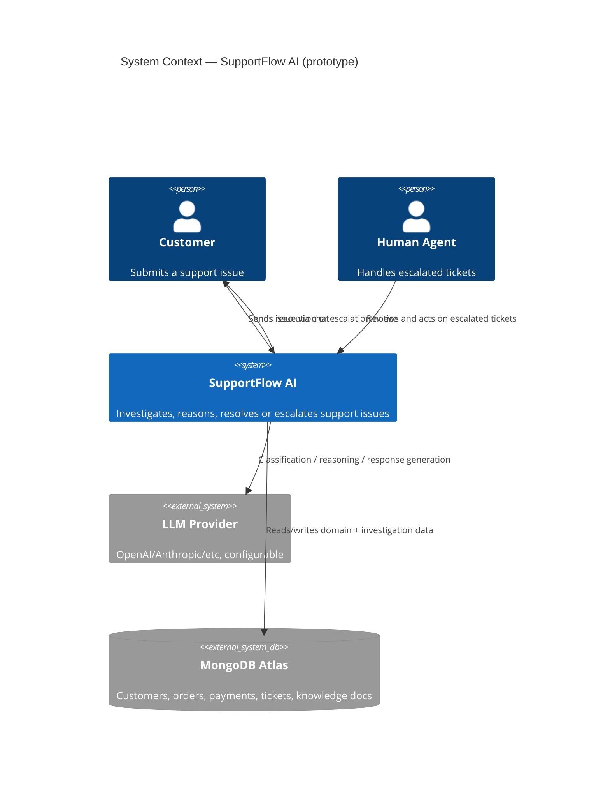
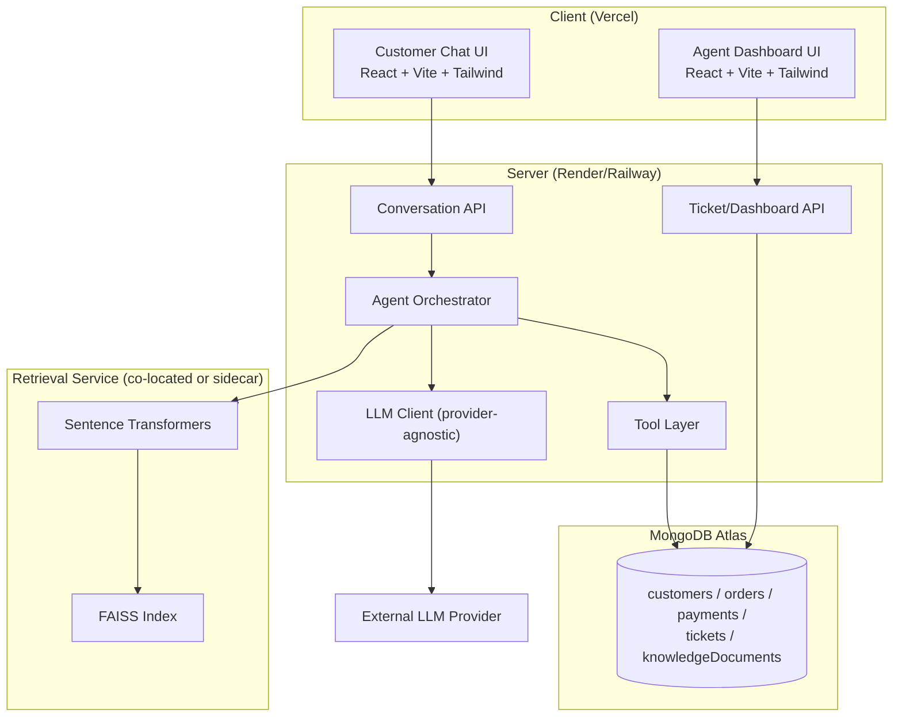
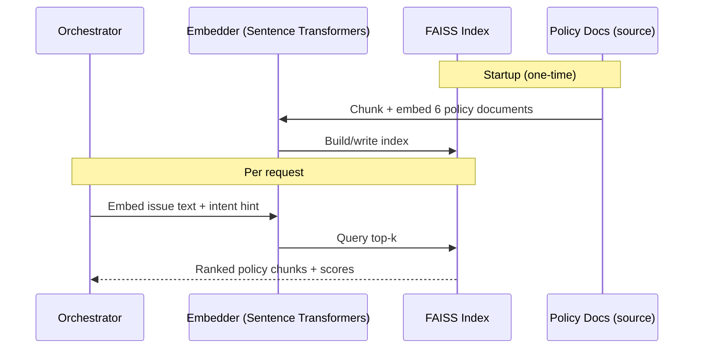
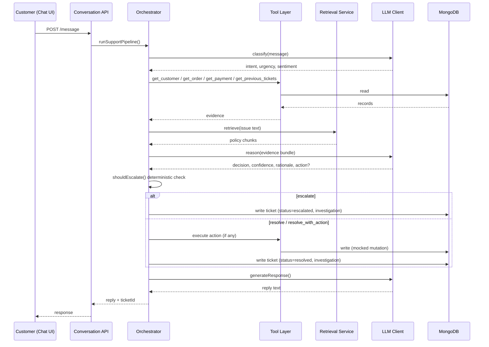
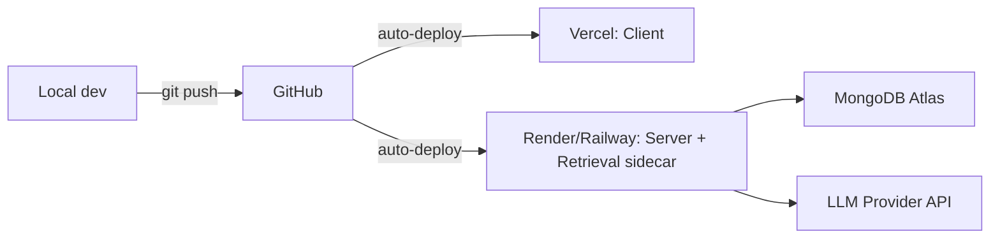

# SAD.md — Software Architecture Document — SupportFlow AI

**Reads:** Architecture.md, PRD.md, design.md, FAD.md, FTL.md, phases.md, Resource_Chart.md
**Status:** Draft v1.0

---

## 1. Architecture goals

Same goals as Architecture.md §2, restated at the software-design level:
- Keep the reasoning loop as explicit, inspectable code (not a black-box single LLM call).
- Keep the LLM provider swappable behind one interface.
- Keep the RAG subsystem decoupled enough that it can degrade to a fallback (keyword match) without breaking the orchestrator's contract.
- Keep prototype and production concerns clearly separated (§16).

## 2. System context



## 3. Container / component architecture



## 4. Frontend architecture

- Two Vite apps sharing a `packages/ui` (or simple shared folder, given the hackathon timeframe — a shared `src/design-tokens.js` + Tailwind config is sufficient) so the design system in design.md stays consistent without a full monorepo tooling investment.
- State management: local component state + a light data-fetching layer (native `fetch` + simple hooks, or React Query if time allows) — no heavier state library needed for this scope.
- Routing: `react-router` with two top-level routes/apps (`/` customer chat, `/dashboard` agent view) if bundled together, or two separate Vite projects if the team prefers full separation (simpler independent deploys to Vercel).

## 5. Backend architecture

- Express app organized by module boundary matching FAD.md, not by generic MVC layering:
  ```text
  server/
    src/
      modules/
        intake/
        identitySignal/
        investigation/
        knowledgeRetrieval/   (client to Retrieval Service)
        reasoning/
        action/
        escalation/
        response/
        ticketDashboard/
      tools/                  (get_customer, get_order, ... — thin, testable functions)
      models/                 (Mongoose schemas)
      routes/
      middleware/
  ```
- The Orchestrator (`modules/` composition) is a single function, `runSupportPipeline(message, conversationId)`, calling each module in the sequence defined in FTL.md §2 — kept as plain composable async functions, not a heavyweight state-machine library, to stay within scope.

## 6. AI agent architecture

- `ai/llmClient.js` exposes `classify()`, `reason()`, `generateResponse()` — three narrow functions rather than one generic `complete()`, so each call site can enforce its own structured-output schema and validation.
- Tool-calling is implemented as **explicit backend-orchestrated calls** (the orchestrator decides which tools to call per FTL.md §4's intent map), not open-ended LLM-initiated function calling — this keeps behavior deterministic and debuggable within a 12-hour build, while still satisfying the "tool-using agent" requirement functionally. Native provider function-calling can be adopted later (see §16) if the team wants the LLM itself to choose tools dynamically.
- All LLM calls request structured JSON output; responses are validated against a schema before being trusted (reject and retry once on malformed JSON, per FTL.md §10).

## 7. RAG architecture



- Runs as a small Python process (FastAPI or a simple script exposing one `/retrieve` endpoint) alongside the Node server, since Sentence Transformers/FAISS are Python-native (flagged in Architecture.md §7). The Node orchestrator calls it over local HTTP.
- Fallback path (per phases.md priority summary): if the Python service is unavailable or over budget to build, `knowledgeRetrieval` module falls back to a simple keyword/substring match against the same 6 documents, returning a lower confidence score — the Reasoning Module and Escalation Module (rule E3) still function correctly against this degraded input.

## 8. Database architecture

Collections (detailed schemas in TAD.md): `customers`, `orders`, `payments`, `tickets` (with embedded `investigation` subdocument), `knowledgeDocuments`. No separate `conversations` collection is strictly required for MVP — a conversation can be represented as the initiating message plus the resulting ticket/investigation record, keeping the data model minimal; if multi-turn conversation history is needed, a lightweight `conversations` collection is added without restructuring the rest.

## 9. Tool / function architecture

Each tool in the Tool Layer is a plain async function with a fixed signature:
```ts
type Tool = (input: Record<string, any>) => Promise<Record<string, any>>
```
registered in a single `toolRegistry.js` map keyed by name (`get_customer`, `get_order`, etc.), so the Orchestrator and the LLM-facing schema descriptions stay in sync from one source of truth.

## 10. External services

- One LLM provider (configurable), accessed only through `llmClient.js`.
- No other external services in prototype scope (no payment gateway, no real ticketing system, no email/SMS provider) — all such integrations are simulated via the Tool Layer per PRD.md non-goals.

## 11. Data flow (request lifecycle)



## 12. Security considerations (prototype-appropriate)

- API keys kept server-side only, never sent to the client.
- Basic input validation on the message endpoint (length limits, type checks) to avoid trivial abuse.
- Mocked identity resolution is acceptable for a hackathon demo but is explicitly **not** treated as real authentication — see §16 and PRD.md non-goals.
- No PII beyond mock/demo data is used or stored.
- CORS restricted to the deployed client origin(s).

## 13. Error handling

Implements FTL.md §10 at the software level: every module boundary (tool call, LLM call, retrieval call) is wrapped in try/catch with a single retry, and every failure path has a defined fallback behavior rather than an unhandled exception — enforced via a shared `safeCall()` utility used by the Orchestrator for every external call.

## 14. Scalability (prototype framing)

Not a design goal for the 12-hour build — noted here only to be explicit about the boundary: single Node process, in-memory/local FAISS index, no horizontal scaling, no caching layer. Acceptable because demo traffic is a handful of concurrent judges, not production load. Production-scale considerations are listed in §16.

## 15. Observability

Prototype scope: structured `console.log`/basic logger for each pipeline stage (useful for live-debugging during the hackathon and for narrating the investigation trail verbally if the dashboard UI has an issue mid-demo). No metrics/tracing infrastructure — explicitly deferred.

## 16. Prototype vs. production architecture

| Concern | Prototype (this build) | Production (future) |
|---|---|---|
| Auth | Mocked/simple session | Real auth (OAuth/JWT), role-based access for agents |
| Tool calling | Backend-orchestrated fixed map | Native LLM function-calling with dynamic tool selection |
| RAG hosting | Local FAISS + sidecar Python process | Managed vector DB, scheduled re-indexing pipeline |
| Payment/order data | Mocked tools | Real integrations with payment gateway / OMS |
| Observability | Console logging | Structured logging, tracing, alerting |
| Scaling | Single instance | Horizontally scaled API, managed queue for long-running investigations |
| Escalation routing | Single shared queue | Skill/team-based routing, SLA-aware prioritization |
| Knowledge base | 6 static documents | CMS-managed, versioned policy documents with editorial workflow |

## 17. Deployment architecture



---

## Consistency check

- All module/tool names match FAD.md and FTL.md exactly.
- Escalation rule reference (E3, RAG fallback) matches FTL.md §6 and phases.md priority summary.
- Prototype/production split matches non-goals in PRD.md §6 and Future scope §15.
- No contradictions found. **Proceeding to Agent 09 → TAD.md.**

*End of SAD.md*
